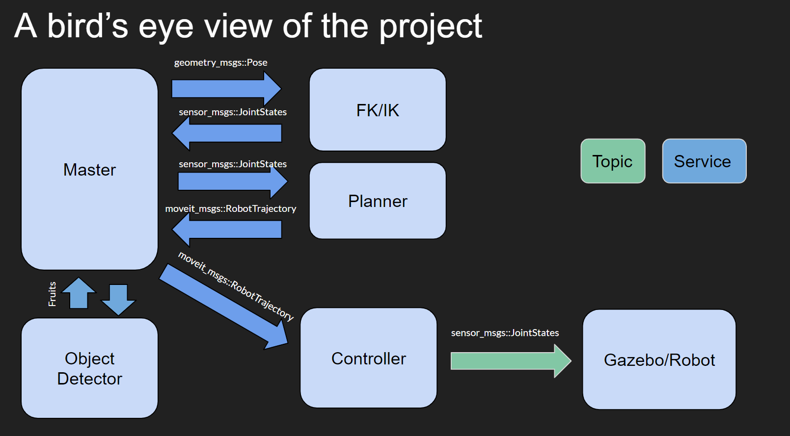
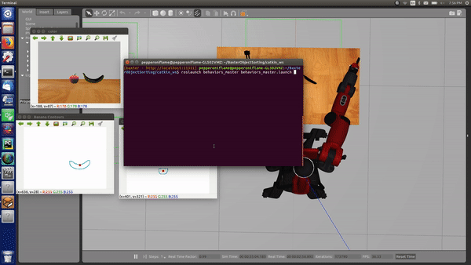

# Object Sorting with the Baxter Robot
> Make the 7-DOF Baxter Robot to sort apples and bananas

The project has four major components:
- Kinematics node - to calculate the FK and IK of the robot
- Computer Vision node - to identify how many apples and bananas are present and calculate their 3D co-ordinates
- Motion Planning node - to plan the trajectory of Baxter's arm
- Control node - move the arm and grasp the fruit

> System architecture


> Demo




## Dependencies and Installation
> Dependencies: ROS Kinetic, Eigen3

To install the dependencies, run:

```
install eigen library from http://eigen.tuxfamily.org/index.php?title=Main_Page#Download

sudo apt-get install gazebo7 ros-kinetic-qt-build ros-kinetic-gazebo-ros-control ros-kinetic-gazebo-ros-pkgs ros-kinetic-ros-control ros-kinetic-control-toolbox ros-kinetic-realtime-tools ros-kinetic-ros-controllers ros-kinetic-xacro python-wstool ros-kinetic-tf-conversions ros-kinetic-kdl-parser ros-kinetic-libfreenect ros-kinetic-freenect-camera ros-kinetic-freenect-launch ros-kinetic-octopmap-server
```

## Running the project

To run the project, install the dependencies, as mentioned above, and execute the follwing commands:

```
git clone https://github.com/wpi-dynamics-spring-2019-baxter/BaxterObjectSorting

cd BaxterObjectSorting/catkin_ws/src

wstool init .

wstool merge https://raw.githubusercontent.com/RethinkRobotics/baxter_simulator/kinetic-devel/baxter_simulator.rosinstall

wstool update

cd ..

catkin_make

cp src/baxter/baxter.sh .

edit baxter.sh to have your local IP and ROS version of "Kinetic"

```
